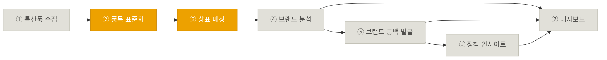

# KIIP — AI 기반 지역 특산품 브랜드 정책지원 플랫폼

특허청 상표 빅데이터와 생성형 AI를 결합해, 지역 특산품의 브랜드(상표) 활용 수준을 자동으로
분석하고 브랜드 공백지역·정책 우선순위를 도출하는 파이프라인. 전체 기획은
[`docs/project-plan.md`](docs/project-plan.md) 참고.

## 파이프라인 (7단계)

🟢 완료 &nbsp;&nbsp; 🟡 진행중(일부 동작) &nbsp;&nbsp; ⚪ 예정

## 단계별 현황

| # | 단계 | 폴더 | 상태 | 한 줄 요약 |
|---|---|---|---|---|
| ① | 지역 특산품 데이터 자동 구축 | [`01-collect-specialties/`](01-collect-specialties/) | ⚪ 예정 | 226개 기초지자체 특산품 목록 자동 수집 |
| ② | 특산품 표준화 및 상품류 매핑 | [`02-normalize-items/`](02-normalize-items/) | 🟡 진행중 | 파이프라인 구현+자체테스트 완료, 실키 스모크 테스트 대기 |
| ③ | 상표정보 자동 수집 | [`03-match-trademarks/`](03-match-trademarks/) | 🟡 진행중 | KIPRIS 상표 검색 — **품목 매칭은 동작, 지역 매칭은 TODO** |
| ④ | 지역 브랜드 분석 | [`04-analyze-brand/`](04-analyze-brand/) | ⚪ 예정 | 지역별·품목별 출원 현황 통계 |
| ⑤ | 브랜드 공백 자동 발굴 | [`05-detect-brand-gap/`](05-detect-brand-gap/) | ⚪ 예정 | 상표 활용도 낮은 지역/품목 탐지 |
| ⑥ | AI 정책 인사이트 생성 | [`06-generate-policy-insight/`](06-generate-policy-insight/) | ⚪ 예정 | 분석 결과 → 정책 브리핑 자동 생성 |
| ⑦ | 대시보드 서비스 | [`07-dashboard/`](07-dashboard/) | ⚪ 예정 | 지역별 현황 + 브랜드 공백 지도 |

각 폴더의 `README.md`에 해당 단계의 목표·할 일·입출력 스키마가 정리되어 있다.

## 문서

- [`docs/project-plan.md`](docs/project-plan.md) — 전체 기획 원문 정리 (프로젝트명·목표·7단계 상세·기대효과)
- [`docs/kipris-api-notes.md`](docs/kipris-api-notes.md) — KIPRIS 상표 Open API 연동 메모 (인증, 엔드포인트, 응답 필드, 지역 매칭 미해결 이슈)

## 개발 방법 (기획 기준)

Claude Code 기반 AI 개발 · Python + Streamlit 웹 서비스 · 상표 Open API 및 공공데이터 연계
