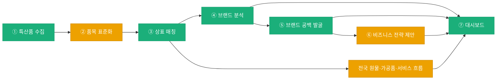

# KIIP — 지역 특산품 상표·사업 확장 분석

공식 지역 특산품 목록과 상표 데이터를 연결해 지역별 브랜드 활동을 확인하고, 전국 상표의
원물→가공품→서비스 흐름에서 사업 확장 단서를 찾는 분석 파이프라인이다.

> 현재 공개본은 수집·검증이 진행 중인 알파 산출물이며 공식 통계가 아니다. 전국 검색 결과를
> 지역 상표 건수로 간주하지 않고, 출원인 주소 등 지역 귀속 근거가 확인된 값만 지역 지표에 쓴다.

## 공개 산출물

- [최신 대시보드](https://omelette-archive.github.io/KIIP-artifacts/latest/)
- [버전별 비교](https://omelette-archive.github.io/KIIP-artifacts/versions/)
- [원본 HTML](07-dashboard/dashboard.html)
- [검토 의견](https://github.com/omelette-archive/KIIP/issues/76)

`main`의 `07-dashboard/dashboard.html`이 바뀌면 공개 산출물 저장소의 최신본과 버전 목록에
자동 반영된다. 자세한 게시 절차는 [`docs/current-artifact.md`](docs/current-artifact.md)를 따른다.

## 현재 워크플로



🟢 핵심 구현 완료 &nbsp;&nbsp; 🟡 진행중(일부 정책·자동화 남음)

| # | 단계 | 폴더 | 상태 | 한 줄 요약 |
|---|---|---|---|---|
| ① | 특산품 수집 | [`01-collect-specialties/`](01-collect-specialties/) | 🟢 | GI·농사로·NFQS·지자체·농촌진흥청 지역특화작목(69개) 등 공식 출처 연동. 정기 자동 실행은 미구축([#70](https://github.com/omelette-archive/KIIP/issues/70)) |
| ② | 품목 표준화 | [`02-normalize-items/`](02-normalize-items/) | 🟡 | 고시상품명칭·NICE류 대조로 자동 확정하고, 애매한 원물명은 검토대기로 남기는 방식을 유지하기로 확정([#51](https://github.com/omelette-archive/KIIP/issues/51)) |
| ③ | 상표 매칭 | [`03-match-trademarks/`](03-match-trademarks/) | 🟢 | KIPRIS 검색 + 출원번호·등록번호 두 경로 주소·지정상품 보강, 호출 예산·캐시([#52](https://github.com/omelette-archive/KIIP/issues/52)), 권리존속기간 만료예정일 기반 재검증([#81](https://github.com/omelette-archive/KIIP/issues/81)) |
| ④ | 브랜드 분석 | [`04-analyze-brand/`](04-analyze-brand/) | 🟢 | 지역 귀속이 검증된 상표만 집계하고, 미검증 hit는 지표 자체를 차단 |
| — | 전국 사업 확장 흐름 | [`04-analyze-brand/`](04-analyze-brand/) | 🟡 | 176개 품목을 원물→가공품→서비스로 분류하고, 원물 단계 출원인이 생산자형으로 확인된 품목만 지역 군집을 노출([#110](https://github.com/omelette-archive/KIIP/issues/110)) |
| ⑤ | 브랜드 공백 발굴 | [`05-detect-brand-gap/`](05-detect-brand-gap/) | 🟢 | 대표 특산품 인정 기준을 지리적표시 또는 지역 귀속 출원 1건 이상으로 확정([#29](https://github.com/omelette-archive/KIIP/issues/29)). 활동량 포화 건수·가중치는 아직 예시값 |
| ⑥ | 비즈니스 전략 제안 | [`06-generate-business-strategy/`](06-generate-business-strategy/) | 🟡 | ⑥-1 고정 템플릿 문장 생성 완료(생성형 AI 미사용), ⑥-2 개별 AI 검토는 사람이 승인하기 전까지 자동 반영되지 않는 별도 흐름 |
| ⑦ | 대시보드 | [`07-dashboard/`](07-dashboard/) | 🟢 | 행정구역 경계 지도 연결([#80](https://github.com/omelette-archive/KIIP/issues/80)), 지역특화작목 대조·전국 사업 확장 흐름 카드 반영 |

분석은 서로 섞지 않는 두 트랙으로 운영한다.

| 트랙 | 질문 | 핵심 근거 |
|---|---|---|
| 지역 브랜드 | 이 지역에 실제로 귀속되는 출원·등록 활동이 있는가 | 공식 지역 목록, 출원인 주소, 등록원부 지정상품 |
| 전국 사업 확장 | 한 품목의 상표가 원물에서 가공품·서비스로 어떻게 확장되는가 | 전국 KIPRIS 후보의 상품류·상표명·출원인 군집 |

현재 구현의 핵심은 다음과 같다.

- 농사로·지리적표시·지자체 자료와 농촌진흥청 9개 도 69개 지역특화작목 등 공식 목록을
  출처 범위 그대로 수집한다. 도 단위 자료를 시군구로 임의 배분하지 않는다.
- 원문 품목은 고시상품명칭·NICE류와 대조해 자동 확정, 승인 별칭, 검토 대기로 구분한다.
- KIPRIS 검색 뒤 출원번호 기반 주소와 등록번호 기반 등록원부를 보강한다. 등록원부는
  지정상품 대조, 호출 예산·429 재개, 캐시, 권리존속기간 만료예정일 기반 재검증을 포함한다.
- 지역 대표 기준은 `지리적표시 등록 또는 지역 귀속 상표 출원 1건 이상`이다. 공백 점수의
  포화 건수·가중치는 아직 운영 기준 확정 전이므로 버전 필드와 함께 해석한다.
- 전국 176개 품목은 NICE류와 상표명 규칙으로 원물·가공품·서비스 단계 및 주요 출원인·지역
  군집을 별도 계산한다. 등록원부 지정상품 대조가 덜 된 분류는 참고 지표이며, 지역 통계나
  대표성 판정에 합산하지 않는다.
- 스냅샷 감사가 지역/전국 경계, 근거 필드, 공개 전 계약 위반을 검사한 뒤 단일 HTML을 만든다.

세부 판정과 남은 한계는 [`docs/data-analysis-guide.md`](docs/data-analysis-guide.md)에 정리한다.

## 실행과 검증

전체 실행 계획을 먼저 확인한다.

```bash
node scripts/runOperationalPipeline.js --dry-run --run-id YYYYMMDD-manual
```

코드·샘플 계약과 현재 대시보드 스냅샷은 각각 다음 명령으로 검사한다.

```bash
node scripts/validatePipeline.js
node scripts/auditDashboardSnapshot.js
```

실제 API 호출, 재개, 산출물 경로는
[`docs/operational-pipeline-runner.md`](docs/operational-pipeline-runner.md)를 따른다.

## 문서 길잡이

| 필요할 때 | 기준 문서 |
|---|---|
| 현재 분석 흐름과 판정 경계 | [`docs/data-analysis-guide.md`](docs/data-analysis-guide.md) |
| 운영 실행·재개 | [`docs/operational-pipeline-runner.md`](docs/operational-pipeline-runner.md) |
| 단계별 입출력 계약 | [`docs/data-pipeline-contracts.md`](docs/data-pipeline-contracts.md) |
| 출처와 원본 근거 | [`docs/data-source-provenance.md`](docs/data-source-provenance.md) |
| 대시보드 데이터 계약 | [`docs/dashboard-data-contract.md`](docs/dashboard-data-contract.md) |
| 등록원부 보강 운영 | [`docs/applicant-region-recovery-runbook.md`](docs/applicant-region-recovery-runbook.md) |

[`docs/project-plan.md`](docs/project-plan.md), 날짜가 붙은 인계·감사 문서, `docs/data-flow/`는
당시 결정과 실행 결과를 보존하는 기록물이다. 현재 상태 판단에는 위 기준 문서를 우선한다.
