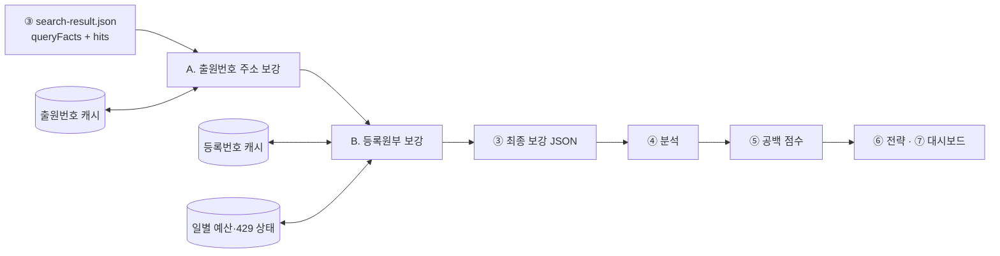

# 출원인 주소 지역 매칭·재분석·복구 런북

이 문서는 ③ 상표 검색 결과에 출원인 지역 근거를 붙이는 두 API 경로와,
수집 중단·규칙 변경·새 입력·주소 미확인 건을 재분석하는 방법을 한곳에서
규정한다. 개별 API 응답 계약은
[`03-match-trademarks/README.md`](../03-match-trademarks/README.md), 키·호출 제한은
[`open-api-validation-runbook.md`](open-api-validation-runbook.md)를 함께 본다.

## 1. 적용 범위와 복구 원칙

- 목표는 전국 상표 검색 후보를 `시도·시군구` 지역으로 안전하게 귀속시키는 것이다.
- 법정동코드 마스터에 후보가 하나일 때만 `matched`로 확정한다. 동명 지역·복수
  출원인·상충하는 주소는 `unverified`로 보류한다.
- API 원문과 출원인 이름·고객번호·상세주소는 영속 저장하지 않는다. 캐시에는
  정규화한 시도·시군구, 정규화 방법·실패 사유, 조회 종료 상태만 남긴다.
- 복구는 **원본 ③ 검색 결과 + 두 영속 캐시 + 규칙/계약 버전**을 기준으로 한다.
  ④ 이후 산출물은 언제든 재생성할 수 있는 파생 데이터로 본다.

## 2. 두 주소 보강 경로

| 구분 | 경로 A — 출원번호 기반 | 경로 B — 등록번호 기반 |
|---|---|---|
| 역할 | 전체 상표 후보의 기본 주소 보강 | 등록상표의 보조·고신뢰 근거와 지정상품 보강 |
| 입력 키 | `applicationNumber` | `registrationNumber` |
| 인증 변수 | `KIPRIS_API_KEY` | `IP_REGISTRY_API_KEY` |
| API | KIPRISPlus `trademarkApplicantInfo` | 공공데이터포털 `getMarkHistory` |
| 주요 응답 | `applicantAddress`, `nationalCode`, `seq` | `applicantAddr`, `applicantNatl`, `rpstrYn`, 지정상품 |
| 대상 | 미등록·심사 중 포함 | 등록번호가 있는 상표만 |
| 캐시 키 | 출원번호 | 등록번호 |
| 기본 캐시 | `trademark-applicant-region-cache.json` | `ip-registry-cache.json` |
| 호출 보호 | 빈 항목 재시도, 연속 오류 회로 차단, 체크포인트 | 일별 예산, 429 재개 시점, 체크포인트 |

경로 A를 먼저 적용한 뒤 경로 B를 적용한다. 그러면 미등록 상표는 A의 주소 근거를
유지하고, 등록상표 중 B 조회가 완료된 건만 등록원부 주소·지정상품 근거로
갱신된다. B가 미수집·오류·호출 대상 아님이면 A에 이미 붙은 근거를 지우지 않는다.



## 3. 필드 계보와 판정 순서

1. ③ 검색 hit의 `applicationNumber`(없으면 `registrationNumber`)로 상표를 중복 제거한다.
2. API 주소를 법정동 마스터와 비교해 `sido`, `sigungu`, `regionStatus`,
   `normalizationMethod`, `normalizationReason`을 만든다.
3. 검색 버킷의 지역과 출원인 지역을 비교해 `applicantRegionMatch` =
   `inside|outside|unverified`를 결정한다.
4. 복수 출원인이 모두 같은 결과일 때 그 결과를 사용한다. 지역이 서로 다르면
   기본은 `multiple_conflicting_applicant_addresses`로 보류하되, **공동출원인 중
   지역 생산 주체형(영농조합·협동조합·생산자단체·지자체 단독표기 등 —
   `03-match-trademarks/lib/producerApplicant.js`)이 해당 지역(`inside`)이면**
   `producer_org_coapplicant_inside`로 그 지역 출원으로 인정한다(#118, 2026-09-02).
   판정은 이름 문자열만 쓰고 이름 자체는 저장하지 않으며 불리언 `producerOrg`만 남는다.
5. ④은 `applicantRegionEvidence` 안의 `regionStatus=matched` 근거만 지역 통계에 사용한다.
   `regionalBrandEvidence`는 농사로 지역브랜드 연관성이며 출원인 주소로 승격하지 않는다.

| 단계 | 필수 필드·버전 | 복구에서의 용도 |
|---|---|---|
| ③ 검색 원본 | `queryFacts`, `applicationNumber`, `registrationNumber`, 검색 계약 버전 | API 키를 재결합하는 기준 |
| A 캐시 | 스키마·API 계약 버전, `fetchedAt`, `found`, `resultCode`, 정규화 지역 | 출원번호 기반 무호출 재적용 |
| B 캐시 | 스키마·API 계약 버전, `fetchedAt`, 정규화 지역·지정상품 | 등록번호 기반 무호출 재적용 |
| B 예산 상태 | KST 날짜, `callsUsed`, `resumeNotBefore` | 중단 후 중복 호출·429 방지 |
| ③ 보강 결과 | `applicantRegionMatch*`, `applicantRegionEvidence`, `applicationApplicantLookup`, `ipRegistryStatus` | ④ 이후 재생성 입력 |
| ④ 분석 | `analysisVersion`, `parameters`, `provenance`, 주소 확인 건수·비율 | 전·후 비교 기준선 |

## 4. 권장 실행 순서

다음 경로는 예시이다. 재분석은 기존 산출물을 덮어쓰지 않고 별도 실행 경로에
저장한다.

### 4.1 실제 API 증분 보강

```powershell
node 03-match-trademarks/enrichApplicantRegions.js `
  --input 03-match-trademarks/output/search-result.json `
  --limit 1000 --concurrency 2 --checkpoint-every 100 `
  --cache 03-match-trademarks/output/trademark-applicant-region-cache.json `
  --out 03-match-trademarks/output/replay-01-applicant.json

node 03-match-trademarks/enrichIpRegistry.js `
  --input 03-match-trademarks/output/replay-01-applicant.json `
  --daily-budget 100 --limit 100 --concurrency 2 --checkpoint-every 50 `
  --cache 03-match-trademarks/output/ip-registry-cache.json `
  --budget-state 03-match-trademarks/output/ip-registry-daily-budget.json `
  --out 03-match-trademarks/output/replay-02-final.json
```

### 4.2 API 호출 없이 현재 캐시 재적용

지역 비교·④ 이후 규칙만 바뀐 경우에 먼저 사용한다.

```powershell
node 03-match-trademarks/enrichApplicantRegions.js `
  --input 03-match-trademarks/output/search-result.json `
  --cache-only `
  --cache 03-match-trademarks/output/trademark-applicant-region-cache.json `
  --out 03-match-trademarks/output/replay-01-applicant.json

node 03-match-trademarks/enrichIpRegistry.js `
  --input 03-match-trademarks/output/replay-01-applicant.json `
  --cache-only `
  --cache 03-match-trademarks/output/ip-registry-cache.json `
  --budget-state 03-match-trademarks/output/ip-registry-daily-budget.json `
  --out 03-match-trademarks/output/replay-02-final.json
```

### 4.3 ④ 이후 재생성

```powershell
node 04-analyze-brand/analyzeBrands.js `
  --input 03-match-trademarks/output/replay-02-final.json `
  --out 04-analyze-brand/output/replay-analysis.json `
  --asOfYear 2026

node 05-detect-brand-gap/detectBrandGap.js `
  --input 04-analyze-brand/output/replay-analysis.json `
  --out 05-detect-brand-gap/output/replay-gap.json
```

⑥·⑦도 같은 `replay` 접두사로 새 경로에 생성한 뒤 기존 산출물과 비교한다.

위 ④~⑦를 한 번에 실행하려면(재조회·캐시 재적용을 마친 ③ 산출물이 준비된 경우):

```powershell
node scripts/regenerateAnalysisFromMatch.js `
  --input 03-match-trademarks/output/replay-02-final.json `
  --before 03-match-trademarks/output/search-result.json `
  --run-id 20260901-refresh-replay
```

실행별 산출물은 `.kiip-operations/regen/runs/<run-id>/`에 모이고, `regen-metadata.json`에
입력 해시·계약 버전·지역매칭 전후 델타가 남는다. 저장소 `dashboard.html`은 덮어쓰지 않는다.

### 4.4 미확인 건 선별 재조회(#73)

시도·시군구 별칭 규칙만 바뀌었고 새 검색은 없을 때, 기준 캐시 전체를 다시
호출하지 않고 `unmatched`·`ambiguous`만 골라 재조회한다.

```powershell
# 1) 후보 규모부터 확인(호출 없음)
node 03-match-trademarks/refreshUnverifiedApplicantRegions.js `
  --cache 03-match-trademarks/output/trademark-applicant-region-cache.json `
  --dry-run `
  --manifest-out 03-match-trademarks/output/refresh-manifest.json

# 2) 실제 재조회 — 기준 캐시는 그대로 두고 별도 캐시에만 기록
node 03-match-trademarks/refreshUnverifiedApplicantRegions.js `
  --cache 03-match-trademarks/output/trademark-applicant-region-cache.json `
  --refresh-cache 03-match-trademarks/output/applicant-region-refresh-cache.json `
  --limit 500 --concurrency 2 --checkpoint-every 100 `
  --daily-budget 1000 --budget-state 03-match-trademarks/output/applicant-region-refresh-daily-budget.json `
  --merged-out 03-match-trademarks/output/trademark-applicant-region-cache.merged.json `
  --report-out 03-match-trademarks/output/refresh-report.json
```

`refresh-report.json`의 `recoveredCount`가 실제로 `unmatched`/`ambiguous`에서
`matched`로 바뀐 건수다. `--merged-out` 결과를 검증한 뒤에만 사람이 기준 캐시
파일을 교체한다 — 이 CLI가 기준 캐시를 자동으로 덮어쓰지 않는다.

### 4.5 이미 complete인 등록번호 재검증(#81)

4.4는 "아직 못 찾은" 건을 다시 찾는 재조회다. 이 절은 반대로 "이미 찾았지만 그 뒤
등록 상태가 바뀌었을 수 있는" 경로 B(등록번호, `ip-registry-cache.json`) 캐시를
다룬다. getMarkHistory 응답에는 `right[]`(설정등록·존속기간갱신등록·소멸등록·
이전등록 등 공식 처분 이력, 사유·일자만 있고 개인정보 없음)와 `cndrtExptnDate`
(권리존속기간만료예정일)가 있다 — 2026-08-31 실키로 필드 존재를 확인했다(이전
파서는 두 필드를 버리고 있었다). 이 신호 덕분에 통계적 TTL을 실측할 필요 없이,
**공식 만료예정일이 이미 지났는데 캐시에는 아직 그 이후 처분 이력이 없는** 건만
정확히 골라 재검증한다(정책명 `expiry_only`, 사용자 결정 2026-08-31 — 대신 만료
전 이전등록처럼 예정일과 무관한 변경은 이 정책으로 못 잡는다는 트레이드오프를
받아들임).

```powershell
# 1) 후보 규모부터 확인(호출 없음)
node 03-match-trademarks/refreshStaleRegistryEntries.js `
  --cache 03-match-trademarks/output/ip-registry-cache-marine-forest.json `
  --dry-run `
  --manifest-out 03-match-trademarks/output/registry-staleness-manifest.json

# 2) 실제 재검증 — 기준 캐시는 그대로 두고 별도 캐시에만 기록
node 03-match-trademarks/refreshStaleRegistryEntries.js `
  --cache 03-match-trademarks/output/ip-registry-cache-marine-forest.json `
  --refresh-cache 03-match-trademarks/output/ip-registry-staleness-refresh-cache.json `
  --limit 200 --concurrency 2 --checkpoint-every 50 `
  --daily-budget 1000 --budget-state 03-match-trademarks/output/registry-staleness-daily-budget.json `
  --merged-out 03-match-trademarks/output/ip-registry-cache-marine-forest.merged.json `
  --report-out 03-match-trademarks/output/registry-staleness-report.json
```

`registry-staleness-report.json`의 `byCategory`가 `no_change`/`address_changed`/
`goods_changed`/`status_changed`/`multiple_changed`/`fetch_failed`로 분리된 전후
변경 건수다. `fetch_failed`는 병합에서 제외되어 이전에 확보한 값을 그대로
지킨다(검증 후에만 병합). **부트스트랩 한계**: 이 정책은 캐시 항목에
`expectedRightExpiryDate`가 있어야만 동작하는데, 이 필드는 2026-08-31 파서
수정 이후에 (재)수집된 항목에만 있다 — 그 전에 수집된 기존 complete 캐시는
전부 `no_expiry_date`로 집계되고(재검증 대상 아님) 정상 동작 4.1/4.2/4.4 경로로
언젠가 다시 조회되기 전까지는 이 절의 재검증 대상이 될 수 없다.

## 5. 상황별 재분석·복구

| 상황 | API 재호출 | 조치 |
|---|---:|---|
| ④∼⑦ 집계·임계값만 변경 | 없음 | 기존 ③ 최종 보강 JSON에서 ④부터 재실행 |
| 지역 비교 규칙만 변경 | 우선 없음 | 두 경로를 `--cache-only`로 재적용 후 ④∼⑦ 재생성 |
| 새 ③ 검색 결과 | 신규 키만 | 같은 캐시를 사용하면 캐시에 없는 출원·등록번호만 증분 호출 |
| 실행 중 종료 | 미완료 키만 | 같은 명령을 재실행. 체크포인트 캐시의 완료 키는 재호출하지 않음 |
| 등록원부 429 | 재개 시점 전 없음 | 예산 상태의 `resumeNotBefore` 이후 재실행. 대기 중은 캐시만 적용 |
| 캐시 계약 버전 불일치·JSON 손상 | 상황별 | 검증을 우회하지 말고 백업 복원. 복원 불가 키만 신규 캐시에 재수집 |
| 기존 `unverified`에 새 별칭 규칙 적용 | 일부 필요 | 아래 “원문 미보존 경계”에 따라 무호출 재적용 가능 건과 선별 재조회 필요 건을 분리 |

### 원문 미보존 경계

상세주소를 저장하지 않는 개인정보 최소화 정책 때문에, 기존 캐시에 이미 정규화된
시도·시군구가 있는 건은 무호출 재분석할 수 있지만 과거에 정규화를 실패한 주소는
원문을 다시 복원할 수 없다. 따라서 시도·시군구 별칭 규칙의 효과를 기존 미확인 건에
적용하려면 **미확인 출원번호 선별 → 제한된 재조회 → 정규화 결과만 새 캐시에
저장**하는 작업이 필요하다.

**구현됨**([#73](https://github.com/omelette-archive/KIIP/issues/73)):
`node 03-match-trademarks/refreshUnverifiedApplicantRegions.js --cache <기준 캐시>`.
`--dry-run`으로 재조회 후보 manifest만 먼저 생성해 규모를 확인하고,
실제 재조회는 `--refresh-cache <별도 경로>`에만 쓴다 — 기준 캐시는 절대 직접
수정하지 않는다. 검증 후 `--merged-out <경로>`로 "개선된 건만" 반영한 새 캐시를
만들어, 사람이 확인한 뒤 기준 캐시를 교체한다. 경로 A(출원번호 기반,
`trademark-applicant-region-cache.json`)와 경로 B(등록번호 기반,
`ip-registry-cache.json`) 둘 다 지원한다 — 경로 B는
`node 03-match-trademarks/refreshUnverifiedRegistryRegions.js --cache <기준 캐시>`를
쓰며 옵션·동작은 경로 A와 동일하다. (과거 이 문서는 "경로 B는 캐시 스키마 확장이
먼저 필요하다"고 적혀 있었으나, 확인해보니 그 확장(`hasSourceAddress` 등)은 이미
돼 있었다 — 2026-08-26, #73.)

## 6. 재분석 전·후 검증표

다음 값을 같은 모집단·같은 ③ 검색 스냅샷에서 비교한다. 검색 입력이 달라졌다면
규칙 효과와 신규 데이터 효과를 분리해 보고한다.

| 구분 | 필수 비교값 |
|---|---|
| 모집단 | ③ 고유 검색 조합, 전국 고유 출원번호, 등록번호 수 |
| A 수집 | 완료·정상 무결과(20)·빈 응답 종료·오류·미수집 수 |
| B 수집 | 완료·not found·오류·미수집·429 수, 예산 사용량 |
| 지역 정규화 | `matched|ambiguous|unmatched`, 별칭·정식명·승계명 방법별 수 |
| 지역 관계 | `inside|outside|unverified`, 미확인 사유별 수 |
| 핵심 비율 | 출원인 지역 확인 가능 비율, 지역×품목 지표 표시 가능 수 |
| 하위 산출물 | ⑤ 대표 특산품 수·랭킹·알림, ⑦ 표시 가능 품목 수 |

재분석 기록에는 입력 파일, 캐시 스키마·계약 버전, 정규화·분석·점수
버전, 실행 시각, 각 출력 경로를 함께 남긴다. 공개 산출물은 검증이 완료된 스냅샷만
새 버전으로 게시한다.

## 7. 현재 한계와 후속 구현

- 경로 A(출원번호)·경로 B(등록번호) 둘 다 미확인 캐시 선별 재조회와 대상 manifest가
  구현됐다([#73](https://github.com/omelette-archive/KIIP/issues/73), 2026-08-26).
- ③ 검색 스냅샷 기준 inside/outside/unverified 전후 비율 자동 집계도 구현됐다
  (`03-match-trademarks/summarizeRegionMatchCoverage.js`, 2026-08-31, [#73](https://github.com/omelette-archive/KIIP/issues/73)).
  API 호출 없이 저장된 ③ 산출물만 읽고, `--before`/`--after`로 전후 델타·비율 변화를
  자동 계산한다. `summarizeIpRegistryMatches()`가 경로 A(출원번호)로만 평가된 hit도
  세도록 넓혀졌고 출처별(`bySource`)·미확인 사유별(`unverifiedByReason`) 분리를 포함한다.
  storageMode=query_facts에서는 compactBatchOutput이 queryFact의 `query.region`을 비우고
  보강 단계가 그 빈 지역 기준으로 `applicantRegionMatch`를 한 번만 저장하므로,
  `regionEvaluatedHitSources()`가 `results`를 펼쳐 저장된 `applicantRegionEvidence`로
  각 `entry.query.region`에 대해 관계를 다시 판정한다. `entry.query.region`이 없는
  전국 카탈로그 행은 지역 귀속 모집단에서 제외한다(안 그러면 그 hit이 전부 unverified로
  들어가 비율을 압도).
- 재조회·캐시 재적용을 마친 ③ 산출물 하나로 ④→⑦ 재생성을 한 번에 수행하는 실행기도
  구현됐다(`scripts/regenerateAnalysisFromMatch.js`, 2026-09-01, [#73](https://github.com/omelette-archive/KIIP/issues/73)).
  `--input <③ 최종 보강 JSON> [--before <기준선 ③ JSON>]`으로 부르면 지역매칭 비율 집계 →
  ④ 분석 → ⑤ 공백 → ⑥ 전략 → ⑦ 스냅샷 → 스냅샷 계약 감사(errors만 차단, 알려진 warning은
  `audit-report.json`에 기록) → 게시 전 후보 HTML을 순서대로 실행하고, 입력 파일 sha256·
  ③ 계약/규칙 버전(검색 스키마·`trademarkSourceMetadata.contractVersion`·경로 A/B
  `applicantRegionMatchVersion`·`goodsMatchVersion`)·실행시각·출력 경로·감사 결과·
  지역매칭 전후 델타를 `regen-metadata.json`에 남긴다. 4.3절의 수동 명령은 개별 단계를
  따로 실행할 때 참고용으로 유지한다. storageMode=query_facts 입력은 `results`를 펼쳐
  각 지역행의 `query.region`으로 관계를 다시 판정하며, 지역이 없는 전국 카탈로그 행은
  지역 귀속 집계에서 제외한다.
- 이미 complete인 등록번호의 변경 감지(4.5절, [#81](https://github.com/omelette-archive/KIIP/issues/81),
  2026-08-31)는 공식 만료예정일 기반 정책(`expiry_only`)으로 구현됐다. 신규 번호 증분
  (4.1)과 기존 번호 재검증(4.5)은 완전히 분리된 CLI라 서로 섞이지 않는다. 아직 없는
  범위: 만료 전 이전등록(양도)처럼 예정일과 무관한 변경 감지, 경로 A(출원번호 기반
  캐시)에 대한 동일한 재검증 — 경로 A 응답에는 아직 이런 처분 이력 필드가 확인되지
  않았다.
- 두 경로의 결과가 모두 있을 때 근거 우선순위는 실행 순서로 구현돼 있다. 후속으로
  A·B 근거를 동시 보존하고 명시적 우선순위를 기록하는 계약이 필요하다.
- **(2026-08-20 결정)** 경로 B가 아직 전체 모집단을 다 돌지 못한 진행 중 상태이므로,
  완료분을 기존 확정 특산품 집계에 조용히 병합하지 않는다. 대시보드에 반영할 때는
  먼저 고시명칭(경로 A) 매칭 뷰와 등록원부(경로 B) 매칭 뷰를 별도로 나란히 비교할 수
  있게 노출하고, 데이터 품질을 검증한 뒤에만 병합 방식을 정한다. 자세한 배경은
  [`03-match-trademarks/README.md`](../03-match-trademarks/README.md)의 "경로 B 반영
  정책" 절을 참고한다.
- 캐시는 로컬·영속 실행 디스크에 보관해야 하며 현재 GitHub 호스티드 러너만으로는
  안전한 복구 기준을 제공하지 못한다. 운영 저장소·백업·보존 정책은 #70에서 구축한다.
